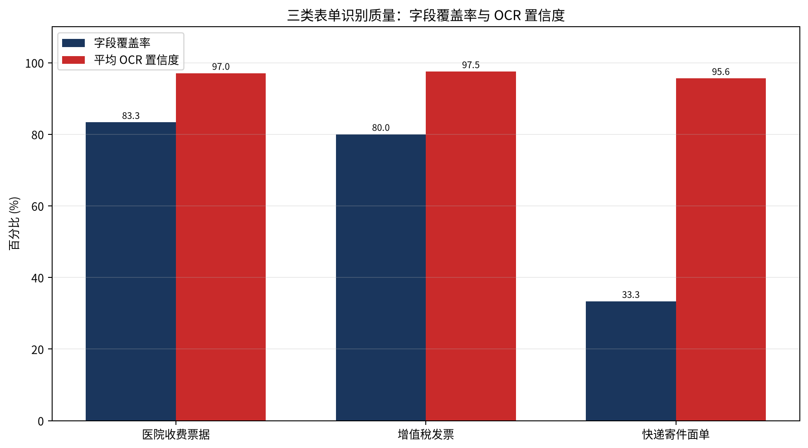
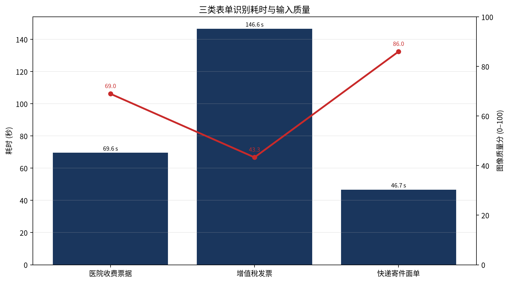

# 三类模板样例实际识别与结果分析

## 1. 实验说明

本次实验使用仓库 `data/samples/` 中的三张真实样例图片，分别对应医院收费票据、增值稅发票和快递寄件面单。每类仅提供一张图片，因此本报告属于**课程设计案例演示分析**，不代表大规模数据集上的泛化性能。实验在 CPU 环境运行，OCR 引擎为 PaddleOCRv6，模板分类器为项目自带 CNN 分类模型，图像预处理模式为当前配置。

运行命令为：

```bash
python3 tools/run_demo_samples.py
python3 tools/make_analysis_charts.py
```

脚本输出了每张图片的原图、OCR 文本框图、OCR 与模板 ROI 图、完整 JSON 结果、CSV 汇总和分析图表。识别过程包含模板分类、PaddleOCRv6 文本检测与识别、模板字段抽取和结果质量统计。

## 2. 总体结果

三张样例均被 CNN 模板分类器正确分类，案例级模板分类准确率为 **3/3，即 100%**。需要强调的是，每个模板只有一个样本，统计量非常小，不能据此宣称模型在真实业务数据上达到 100% 准确率。

| 模板 | 分类结果 | OCR 文本框数 | 平均 OCR 置信度 | 字段覆盖率 | 图像质量分 | 端到端耗时 |
|---|---|---:|---:|---:|---:|---:|
| 医院收费票据 | 正确 | 61 | 97.05% | 83.33%（5/6） | 68.98 | 69.56 秒 |
| 增值稅发票 | 正确 | 74 | 97.52% | 80.00%（4/5） | 43.33 | 146.63 秒 |
| 快递寄件面单 | 正确 | 24 | 95.63% | 33.33%（1/3） | 86.01 | 46.70 秒 |



**图 1  三类表单字段覆盖率与 OCR 平均置信度**

从图 1 可以看出，三类样例的 OCR 平均置信度都较高，范围为 95.63%—97.52%，但字段覆盖率差异明显。快递寄件面单虽然图像质量分最高，字段覆盖率却只有 33.33%。这说明 OCR 文本框置信度高并不等于模板字段抽取完整，字段 ROI 配置和模板版式适配同样重要。医院收费票据和增值税发票的字段覆盖率分别为 83.33% 和 80.00%，说明当前模板配置对这两类样例更匹配。

## 3. 图像质量与速度分析



**图 2  三类表单识别耗时与图像质量分**

增值稅发票的图像质量分为 43.33，是三类样例中最低的，同时端到端耗时达到 146.63 秒。日志显示该图片原始尺寸较大，PaddleOCRv6 将其调整到最大边长限制内后再执行识别，较大的输入尺寸和复杂票据版面共同增加了处理时间。医院收费票据的图像质量分为 68.98，耗时 69.56 秒。快递面单图像质量分为 86.01，文字框数量最少，耗时也最低，为 46.70 秒。

当前耗时主要集中在 OCR 阶段：医院票据 OCR 阶段约 64.59 秒，发票约 144.51 秒，快递面单约 46.55 秒。模板分类和字段抽取只占较小部分。因此，后续若要提升交互速度，应优先优化输入尺寸、检测模型配置和运行设备，而不是只优化字段规则。

## 4. 分类结果分析

| 样例 | 人工标签 | CNN 预测 | 是否正确 |
|---|---|---|---|
| sample_hospital.jpg | 医院收费票据 | 医院收费票据 | 是 |
| sample_invoice.jpg | 增值稅发票 | 增值稅发票 | 是 |
| sample_package.jpeg | 快递寄件面单 | 快递寄件面单 | 是 |

本次分类结果说明，项目自带 CNN 分类模型能够正确区分这三张与其模板类别对应的样例。由于每一类只有一张图片，当前实验只能验证“开箱样例流程能够正确运行”，不能分析不同拍摄角度、不同光照和不同版式下的分类稳定性。论文中应把这一结果表述为案例验证，并在获得更多数据后继续补充混淆矩阵、每类召回率和平均耗时。

## 5. 识别结果与字段抽取分析

医院收费票据识别出 61 个文本框，平均置信度为 97.05%，模板字段成功抽取 5 个。该样例的字段覆盖率最高，说明当前 ROI 配置与票据版式较匹配，但仍有 1 个字段未识别，需要通过原图、OCR 框和 ROI 框进一步定位原因。

增值稅发票识别出 74 个文本框，平均置信度为 97.52%，模板字段成功抽取 4 个。该样例图像质量分最低且耗时最高，但 OCR 平均置信度仍然较高，说明局部文本检测和识别效果尚可；字段覆盖率未达到完整识别，可能与印章、复杂表格线或 ROI 区域偏移有关。

快递寄件面单识别出 24 个文本框，平均置信度为 95.63%，但 3 个配置字段中仅识别出 1 个。该结果是本次实验最值得分析的案例：图像质量较好并不意味着字段抽取一定成功。后续应检查快递面单模板 JSON 的参考尺寸、字段坐标和字段名称是否与该样例版式一致，并考虑使用关键词相对位置或动态版面匹配替代固定 ROI。

## 6. 截图素材目录

每个模板目录包含以下文件：

| 文件 | 用途 |
|---|---|
| `01_original.jpg` | 论文中的输入样例图 |
| `02_ocr_boxes.jpg` | 展示 PaddleOCRv6 检测框和识别区域 |
| `03_ocr_roi.jpg` | 展示文本框与模板字段 ROI 的对应关系 |

这些截图适合直接用于论文的系统实现、典型案例和错误分析章节。论文中应在截图下方标明模板类别、模型为 PaddleOCRv6，并说明样本量为每类 1 张。

## 7. 结论与论文使用建议

本次真实运行验证了项目能够完成三类表单的端到端分类与 OCR 识别，三张样例均被正确分类，且成功生成了可追溯的文本框、字段结果、质量评分、耗时和截图素材。结果同时显示，分类准确率、OCR 文本置信度和字段覆盖率是三个不同层次的指标，不能用其中一个指标替代其他指标。特别是快递面单案例证明，后处理字段配置仍是当前系统需要重点完善的部分。

建议在课程论文中将本次实验定位为“开箱样例端到端验证”，使用图 1 和图 2 说明结果差异，并把快递面单字段覆盖率较低作为问题分析案例。若后续能够获得每类至少 20—50 张脱敏样本，应重新运行同一脚本，补充分类混淆矩阵、字段准确率、字符错误率和耗时分布，再把案例性结论升级为具有统计意义的实验结论。
