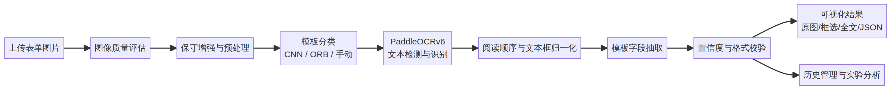
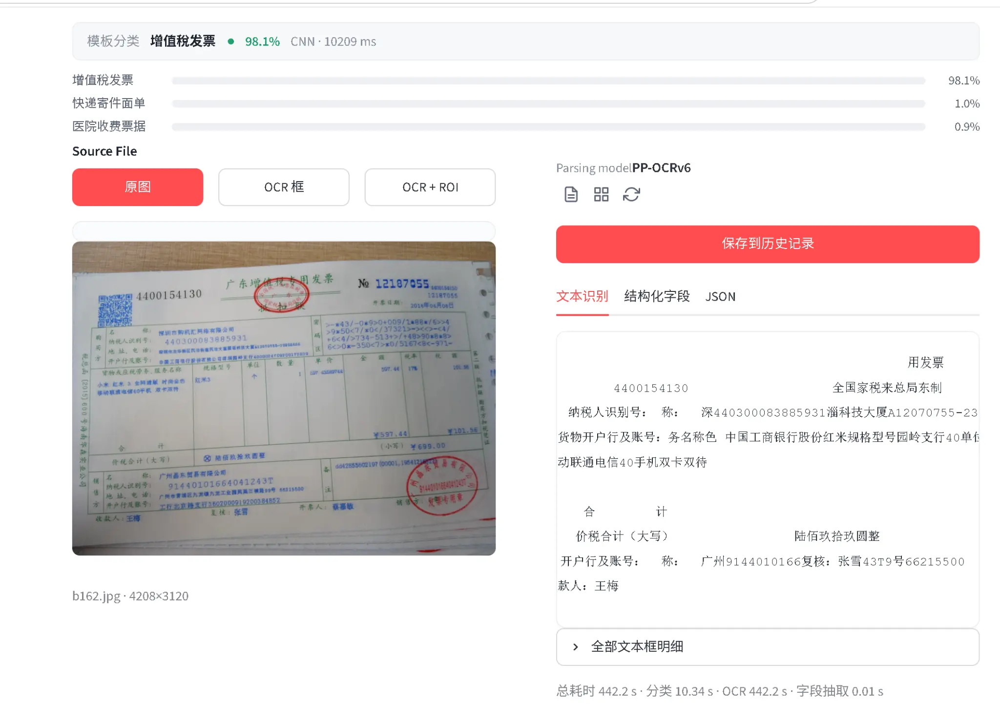

# 多模板表单自动识别和管理系统

## 课程设计报告

**项目方向：** 基于已有模型和框架的应用调试与结果分析  
**核心 OCR 引擎：** PaddleOCRv6  
**应用场景：** 发票、医院收费票据、快递寄件面单等中文表单识别与管理

## 摘要

日常办公中，大量发票、收费票据和寄件面单仍以图片或扫描件形式流转。人工抄录这些表单不仅效率低，而且容易在金额、日期、号码和企业信息等关键字段上产生错误。本课程设计没有从零训练文字识别模型，而是以成熟的 PaddleOCRv6 为核心，结合模板分类、图像预处理、字段抽取、规则校验和 Streamlit 可视化界面，构建一个多模板表单自动识别和管理系统。系统重点解决复杂拍摄条件下的识别可解释性问题：用户不仅能够看到识别文字，还可以通过文本框、字段来源、置信度、图像质量分数和校验提示判断结果是否需要人工复核。

本项目的技术重点是应用已有模型并围绕真实场景进行调试。系统保留 CNN 模板分类器和 ORB 对比基线，将 PaddleOCRv6 识别结果统一转换为文本框、文字和置信度数据，再通过模板字段区域进行结构化抽取。针对低对比度、轻度模糊、亮度不均和手机拍摄倾斜等问题，系统增加了保守图像增强和质量评估模块。实验部分设计了基线对比、预处理消融、模板分层和困难样本分析流程。由于真实表单数据包含隐私信息，仓库不直接打包数据；系统提供可复现实验脚本，实际准确率应使用脱敏测试集运行生成，不能使用模拟数据替代。

**关键词：** 多模板表单；PaddleOCRv6；模板分类；字段抽取；结果分析

## 1 研究背景与应用场景

光学字符识别（Optical Character Recognition，OCR）是将图像中的文字转换为机器可处理文本的技术。课程设计要求强调，实际应用中通常不需要从零搭建模型，更重要的是理解场景、选择成熟工具、调试已有算法并对结果进行分析。因此，本项目把研究对象从“如何训练一个识别模型”转为“如何把成熟 OCR 引擎应用到多种表单，并让识别结果可解释、可管理、可验证”。

系统以中文增值税发票作为主要展示案例，同时兼顾医院收费票据和快递寄件面单。不同模板的版式、字段名称和字段位置差异明显，单纯输出一段全文文本不能满足业务需要。例如，发票识别通常需要分别获得发票号码、开票日期、购买方、销售方、金额、税额和价税合计；医院票据更关注患者信息、收费项目和金额；快递面单则关注寄件人、收件人和运单号码。因此，系统需要先判断模板类型，再使用对应字段配置完成结构化抽取。

## 2 需求分析与系统目标

系统输入为 PNG、JPG、JPEG、BMP、WEBP 和 TIFF 等常见图片。用户可以上传自己的表单图片，也可以选择测试集中的样例。系统输出包括四个层次。第一层是原图和增强图，帮助用户判断输入质量。第二层是 OCR 文本框，每个文本框包含坐标、识别文本和置信度。第三层是模板字段，例如发票号码、日期和金额。第四层是质量分析，包括图片清晰度、亮度、对比度、倾斜角、字段覆盖率、低置信度文本数量和格式校验状态。

系统目标并不是对所有复杂图片做无条件自动化，而是在结果不可靠时主动提示人工复核。这样的设计更符合表单数字化应用的实际需求，也能避免把低置信度输出误认为正确结果。系统还需要记录模型配置、预处理模式、各阶段耗时和警告信息，从而为课程论文中的实验复现提供依据。

## 3 技术路线

系统总体流程如图 1 所示。

**图 1  多模板表单自动识别和管理系统流程**

首先，系统对输入图像进行解码和质量评估。质量评估使用拉普拉斯方差估计清晰度，使用灰度均值和标准差估计亮度与对比度，并通过边缘直线估计轻度倾斜角。然后使用基于 LAB 颜色空间和 CLAHE 的保守增强。默认模式为 `balanced`，其目标不是改变版式，而是改善低对比度文字的可见性；用户也可以在配置文件中关闭增强或切换到更强的模式。

第二步是模板分类。系统保留 MobileNetV2 CNN 主方案，并保留 ORB 特征匹配作为对比基线。对于明确知道模板的演示场景，也可以选择仅 OCR 模式，避免分类器错误影响文字识别。模板分类结果会显示类别、置信度、候选类别分数和分类耗时。

第三步是 PaddleOCRv6 识别。项目通过适配层兼容 PaddleOCR 新版 `predict` 返回结构和旧版 `ocr` 返回结构，将结果统一为 `OCRItem`。每个 `OCRItem` 包含多边形坐标、文字和置信度，业务层不依赖 PaddleOCR 的原始对象。识别完成后，系统按文本框位置整理阅读顺序，并在界面中支持原图、OCR 框和 OCR 加 ROI 三种视图。

第四步是字段抽取。每个模板使用 JSON 文件描述字段名称、参考尺寸、字段区域和匹配方式。字段抽取根据 OCR 框中心点或交并比判断文本是否属于某一字段，再按位置排序拼接文本。系统同时计算字段平均置信度，并对日期、金额、号码和代码等字段进行基础格式校验。校验结果只表示“格式上值得信任或需要复核”，不替代人工标注的真实准确率。

## 4 系统实现与界面设计

系统采用模块化单体架构。`core` 目录负责配置、图像处理、模板分类、OCR 适配、字段抽取和流水线编排；`ui` 目录负责 Streamlit 页面；`database` 目录负责识别历史记录；`config/templates` 目录负责各模板字段配置。这样的划分使模型、界面和业务逻辑相互隔离，便于后续更换辅助模型或增加新的表单模板。

界面参考 PaddleOCR AI Studio 风格进行改造。左侧展示文件上传、示例图片和模板分类方式；中央展示可缩放的原图和 OCR 框；右侧展示文本识别、结构化字段和 JSON 三类结果。识别完成后，界面额外显示平均文字置信度、字段覆盖率、图像质量和待复核文本数量。用户可以下载识别 JSON，并将结果保存到历史记录。

当前界面已经能够展示分类、PaddleOCRv6 识别、字段抽取和历史管理，但复杂图片上的效果仍取决于输入质量和模型配置。图 2 是当前系统的识别界面案例。

**图 2  发票识别与文本结果展示界面**

从案例可以观察到，原图存在拍摄倾斜、局部模糊和红色印章干扰。页面虽然已经输出了发票号码、购买方和金额等文本，但原始文本直接堆叠时不容易判断每段文字来自哪里。因此，改造后的重点不是单纯增加文字数量，而是显示 OCR 框、字段来源和质量提示，使用户可以追溯结果证据。

## 5 实验设计与结果分析方法

实验数据应使用脱敏真实表单图片，按照训练集、验证集和测试集划分，并覆盖清晰样本、复杂拍摄样本和困难样本。困难样本包括低亮度、反光、明显倾斜、印章遮挡、局部裁切和文字较小的图片。项目提供 `tools/run_experiment.py`，能够固定 PaddleOCRv6 配置，批量运行测试集，并输出 JSONL、CSV 和运行配置文件。

实验设置包括四类。第一类是基线对比，比较当前实现与增加预处理、质量分析后的 PaddleOCRv6 链路。第二类是预处理消融，比较原图、平衡增强、强增强和多路候选。第三类是模板分层，分别统计发票、医院收费票据和快递寄件面单的结果。第四类是困难样本分析，观察清晰度、倾斜和印章遮挡对字段识别的影响。

主要指标如下表所示。

| 指标 | 含义 | 适用层次 |
|---|---|---|
| 模板分类准确率 | 预测模板与人工标注模板一致的比例 | 模板分类 |
| 字段准确率 | 关键字段与人工标注完全一致的比例 | 结构化结果 |
| 字段覆盖率 | 已识别字段数占配置字段数的比例 | 结构化结果 |
| 字符编辑距离 | OCR 文本与人工文本之间的差异 | 全文识别 |
| 低置信度召回率 | 低置信度框中实际错误框的比例 | 质量分析 |
| 平均处理时间 | 单张图片从输入到结果的耗时 | 系统性能 |

仓库当前测试代码的结构性验证结果为 **26 项测试全部通过**，证明配置、数据库、字段抽取、OCR 结果归一化和流水线等模块能够通过已有自动化检查。这一结果不是 OCR 准确率，不能替代真实图片实验。真实识别指标应在获得脱敏测试集后运行实验脚本生成，并将 CSV 中的实际数值填入论文图表。

## 6 典型问题与改进方向

当前识别效果较差的主要原因不是单一模型名称，而是图像质量、版面复杂度、印章遮挡和字段后处理共同造成的。第一，原图如果分辨率不足或严重模糊，任何 OCR 引擎都无法恢复已经丢失的笔画。第二，表单中的横线、表格和印章会增加检测难度，可能造成文本框合并或切分不合理。第三，全文识别正确并不代表字段抽取正确，因为字段可能被分配到相邻区域。第四，CPU 环境下高质量链路会增加耗时，需要在现场演示和论文实验之间选择不同运行模式。

后续可以增加透视变换、版面区域检测、表格结构识别和人工框选 ROI。对于高价值字段，可以使用 OCR 多候选结果与格式规则联合排序，而不是只取单次最高分。对于新的表单模板，优先增加 JSON 字段配置和少量模板样例，再决定是否重新训练分类器。这样可以控制课设项目复杂度，同时体现成熟工具的应用和调试思路。

## 7 结论

本课程设计完成了一个以 PaddleOCRv6 为核心的多模板表单自动识别和管理系统方案。项目没有从零训练 OCR 模型，而是围绕真实表单场景完成模型适配、图像增强、模板分类、字段抽取、规则校验、结果可视化和实验记录。系统的主要价值在于把“识别出文字”扩展为“展示文字证据、判断结果质量、管理结构化结果并支持实验分析”。

在正式答辩中，演示应优先选择一张清晰发票和一张复杂表单，分别展示快速识别与高精度识别模式。对于复杂案例，应主动说明哪些字段被标记为需要复核，并展示图像质量分数、文本框置信度和字段校验状态。这样既能展示成熟 OCR 工具的应用效果，也能客观说明系统的边界和改进方向。

## 参考文献

[1]: https://www.paddleocr.ai/latest/version3.x/pipeline_usage/OCR.html "PaddleOCR OCR Pipeline Usage"

[2]: https://github.com/PaddlePaddle/PaddleOCR "PaddleOCR Official GitHub Repository"

[3]: https://docs.opencv.org/4.x/d5/daf/tutorial_py_histogram_equalization.html "OpenCV Histogram Equalization Documentation"

[4]: https://streamlit.io/ "Streamlit Official Website"
